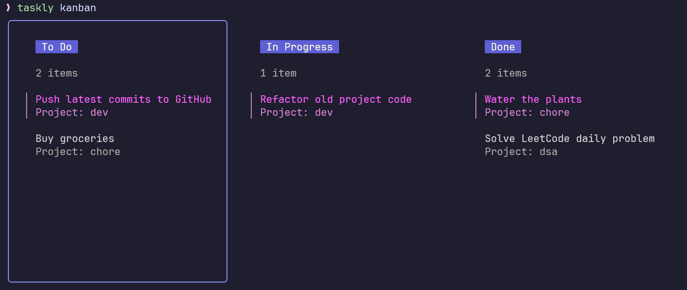

# Taskly

**Taskly** is a CLI-based task management tool built in **Go** using the
**Cobra** package. It features data storage with **SQLite**, visually styled
output with **Lip Gloss**, and an interactive **Kanban** board view powered by
**Bubble Tea**. Taskly makes it easy to **add**, **edit**, **delete**, and
**manage** tasks directly from the terminal.




## Features

- **Task Management:** Add, delete, update, and list tasks.
- **Project Organization:** Assign tasks to specific projects for better
  organization.
- **SQLite Database Integration:** Efficient storage and retrieval of tasks.
- **Styled Output:** Stylish table and Kanban layouts using Lip Gloss.
- **Kanban Board Interface:** Visualize tasks as a Kanban board with Bubble Tea.

## Installation

Clone the repository and navigate to the project directory:

```bash
git clone https://github.com/ashish0kumar/taskly.git
cd taskly
```

### Prerequisites

Ensure Go is installed on your system. You can install Taskly with the following
commands:

```bash
go mod download
go build -o taskly
```

This will create a binary executable named `taskly`.

## Usage

Use Taskly commands from your terminal to manage tasks. The main command is
`taskly`, followed by subcommands to perform specific actions.

### Commands

- **Add a Task:** Add a new task, optionally specifying a project name

  ```bash
  taskly add "Task Name" -p "Project Name"
  ```

- **Delete a Task:** Delete a task by its unique ID:

  ```bash
  taskly delete <ID>
  ```

- **Update a Task:** Update a task's name, project, or status:

  ```bash
  taskly update <ID> -n "New Task Name" -p "New Project Name" -s <status>
  ```

  _Status options:_
  - `0` for "todo"
  - `1` for "in progress"
  - `2` for "done"

- **List All Tasks:** List all stored tasks in a table format:

  ```bash
  taskly list
  ```

- **View Kanban Board:** Display tasks in a Kanban board layout. Tasks are
  categorized into "todo," "in progress," and "done" columns:

  ```bash
  taskly kanban
  ```

- **View Database Path:** Locate the database file where tasks are stored:

  ```bash
  taskly where
  ```

## Examples

1. **Adding a Task with Project Name**

```bash
taskly add "Design Homepage" -p "Website Redesign"
```

2. **Updating a Task's Status**

```bash
taskly update 1 -s 1
```

3. **Listing All Tasks**

```bash
taskly list
```

This command shows tasks in a formatted table with columns for ID, Name,
Project, Status, and Creation Date.

4. **Viewing the Kanban Board**

```bash
taskly kanban
```

This displays tasks in a Kanban layout, categorized by status.

### Data Storage

Taskly uses a SQLite database to persist tasks. The database is stored in an
XDG-compliant directory (typically `$HOME/.local/share/tasks.db`). This
structure enables easy backup and integration across systems.

## Dependencies

- [Cobra](https://github.com/spf13/cobra): CLI command framework.
- [Bubble Tea](https://github.com/charmbracelet/bubbletea): TUI framework for
  the Kanban board.
- [Lip Gloss](https://github.com/charmbracelet/lipgloss): Used for stylish table
  layouts.
- [SQLite](https://github.com/mattn/go-sqlite3): Lightweight, serverless SQL
  database.

## Contributions

Contributions are welcome! Please fork the repository, create a new branch, and
submit a pull request.

## License

[MIT](LICENSE)
